<p align="center">
  
</p>

<p align="center">
  <a href="https://github.com/ishandutta2007/Awesome-Awesome-Awesome"></a><a href="https://discord.gg/jc4xtF58Ve"></a>
  <a href="https://github.com/ishandutta2007/Awesome-Virtual-Event-Platform/stargazers"></a>
  <a href="https://github.com/ishandutta2007/Awesome-Virtual-Event-Platform/network/members"></a>
  <a href="https://github.com/ishandutta2007/Awesome-Virtual-Event-Platform/blob/main/LICENSE"></a>
  <a href="https://github.com/ishandutta2007/Awesome-Virtual-Event-Platform/pulls"></a>
  <a href="https://github.com/ishandutta2007"></a>
</p>


# 🌐 Awesome Virtual Event Platform

> 🚀 **The Ultimate Curated Directory of SaaS Solutions & Open-Source Projects for Virtual Conferences, Online Webinars, Hybrid Summits, 3D Expos, WebRTC Live Streams, and Interactive Attendee Networking.**

Whether you are an enterprise event marketer looking for an all-in-one commercial platform or an engineering team building custom event infrastructure using open-source WebRTC media servers and self-hosted ticketing solutions, this guide covers everything you need.


## 📑 Table of Contents

- [🌟 Overview & SEO Taxonomy](#-overview--seo-taxonomy)
- [🏢 SaaS & Hosted Platforms](#-saashosted-platforms)
- [🔓 Open-Source GitHub Projects](#-open-source-github-projects)
- [🧩 Event Tech Stack & Architectural Guide](#-event-tech-stack--architectural-guide)
- [💡 Key Evaluation Criteria for Event Platforms](#-key-evaluation-criteria-for-event-platforms)
- [🤝 How to Contribute](#-how-to-contribute)
- [📈 Star History](#-star-history)
- [📜 Disclaimer & License](#-disclaimer--license)


## 🌟 Overview & SEO Taxonomy

Virtual and hybrid event platforms combine video broadcasting, real-time messaging, ticketing, and audience engagement into unified digital spaces. 

### 🎯 Key Search Themes & Target Categories:
- **🎙️ Webinar & Broadcasting Software**: Multi-speaker stages, RTMP/WebRTC broadcast studios, screen-sharing, recording, and AI transcriptions.
- **🎪 Virtual Conference & Multi-Track Summits**: Parallel session tracks, speaker green rooms, keynote stages, and digital agenda builders.
- **🏛️ 3D Virtual Expos & Trade Shows**: Interactive sponsor booths, lead retrieval, downloadable collateral, and 3D floor layouts.
- **🤝 Spatial & Speed Networking Lounges**: Virtual tables, 1-on-1 matchmaking, serendipitous speed networking, and breakout rooms.
- **🎟️ Self-Hosted Event Management & Ticketing**: Call for Papers (CfP), QR check-in, registration workflows, badge printing, and GDPR compliance.


## 🏢 SaaS/Hosted Platforms

*Ranked in descending order by company scale (Revenue / Valuation / Market Cap).*

| Platform | Company Size (Revenue / Valuation) | Starting Pricing | Free Tier / Free Trial Limits | Description |
| :--- | :--- | :--- | :--- | :--- |
| **[RingCentral Events](https://www.ringcentral.com/rc-events.html)** *(formerly Hopin)* | **~$2.4B Annual Revenue** / **~$2.8B Market Cap** *(NYSE: RNG; Hopin peak val $7.75B)* | **$99/month** per organizer (billed annually, Events Pro plan) | **30-day free trial** (up to 10 organizer seats, 1,000 registrations; no permanent free plan) | 🎟️ All-in-one virtual, hybrid, and onsite event platform with stages, sessions, networking, expo halls, registration, and AI tools for content/Q&A. |
| **[Bizzabo](https://www.bizzabo.com/)** | **~$1.4B Valuation** *($138M+ funding raised)* | **$17,999/year** (Starter tier, billed annually, 3-user minimum) | **No permanent free plan**; provides personalized demo sandbox access on request | 🏢 Enterprise event management platform for virtual, hybrid, and in-person programs with robust marketing, registration, and Klik wearable tech. |
| **[ON24](https://www.on24.com/)** | **~$150M Annual Revenue** / **~$300M+ Market Cap** *(NYSE: ONTF)* | **~$10,000/year** (Essentials tier annual contract) | **No permanent free plan**; offers 30-day trial for select features (e.g., Advanced Analytics) & interactive sandbox demos | 📊 Enterprise webinar and virtual event platform specialized in B2B demand generation, deep analytics, lead scoring, and content engagement hubs. |
| **[Goldcast](https://www.goldcast.io/)** | **~$150M–$200M Valuation** *($40M+ Series A funding)* | **~$1,500/quarter** (~$6,000/year) for Starter tier | **Free forever plan for Content Lab** (1 user, 5 hrs video upload upon signup then 1 hr/month); **14-day evaluation trial** on request | 🎬 B2B content marketing and virtual event platform focused on webinars, summits, video repurposing with AI, and CRM-connected analytics. |
| **[Hubilo](https://www.hubilo.com/)** *(Brandlive Virtual PRO)* | **~$120M–$150M Valuation** *($153M+ funding; acquired by Brandlive)* | **~$10,000/year** (Virtual PRO enterprise plan) | **No permanent free plan**; provides custom sandbox demo / pilot access via sales request | 🎮 High-engagement virtual and hybrid event platform with gamification, networking, multi-track conferences, and production studio capabilities. |
| **[Airmeet](https://www.airmeet.com/)** | **~$100M Valuation** *($50M+ funding raised)* | **$167/month** (billed annually) / $199/month (billed monthly) for Premium Webinars | **Free forever plan** (up to 100 registrants/attendees per event with core engagement tools); **10-day free trial** for premium features | 💬 Virtual and hybrid event platform optimized for community and networking with social lounges, speed networking, webinars, and high engagement. |
| **[SpotMe](https://www.spotme.com/)** | **~$30M–$40M Annual Revenue** *(PE-backed enterprise scale)* | **~$4,800–$5,000/event** package (or ~$12,000/year for Starter campaign plan) | **No permanent free plan**; offers 14-day guided evaluation sandbox access on request (limited to 25 test users) | 🔒 Enterprise virtual and hybrid event platform for regulated industries (pharma, finance) with strict compliance, white-glove service, and branded mobile apps. |
| **[vFairs](https://www.vfairs.com/)** | **~$30M+ Annual Revenue** *(Bootstrapped & profitable)* | **~$5,000–$7,500/event** package (or ~$12,000/year for annual license) | **No permanent free plan**; provides guided interactive demo sandbox environment upon consultation | 🎪 Immersive 3D virtual event and trade-show platform with customized 3D virtual booths, expos, career fairs, and avatar environments. |
| **[Swapcard](https://www.swapcard.com/)** | **~$25M+ Annual Revenue** *($40M+ event GMV)* | **~$610/year** (Entry Engagement license) or ~$1,500+/event package | **Free community sandbox** for small test events with core features up to 50 event contacts / interactive live demo | 🤖 AI-powered event platform emphasizing smart matchmaking, structured networking, exhibitor ROI, and hybrid event experiences. |
| **[BigMarker](https://www.bigmarker.com/)** | **~$20M–$25M Annual Revenue** *(Acquired by Financial Times)* | **$79–$99/month** (billed annually, Starter tier for up to 100 attendees, 1 host license) | **7-day free trial** (limited to test webinars, up to 10 attendees; no permanent free plan) | 🌐 Browser-based webinar and virtual event platform with no downloads required, strong for multi-session series and marketing automation. |
| **[EventMobi](https://www.eventmobi.com/)** | **~$15M–$20M Annual Revenue** *(Profitable, 10,000+ events across 72 countries)* | **$3,000–$3,500/event** (or ~$8,900/year for multi-event plan; ~$1–$4 per attendee) | **No permanent free plan**; offers interactive product tour and sandbox demo on request | 📱 Mobile-first event platform supporting virtual, hybrid, and in-person events with native apps, live polling, agendas, and interactive networking. |
| **[Accelevents](https://www.accelevents.com/)** | **~$12M–$15M Annual Revenue** *(Inc. 5000 fast-growing enterprise)* | **$7,000–$7,500/year** (Professional tier for up to 500 attendees) / $13,500 for Business tier | **Free test setup mode** (build and preview events with up to 25 test participants; $1.50 + 3.5% fee if publishing paid tickets) | ⚡ Flexible virtual, hybrid, and in-person event management platform with ticketing, registration, live streaming, networking, and sponsor booths. |
| **[Remo](https://remo.co/)** | **~$5M–$10M Annual Revenue** *(~$20M Valuation)* | **$299/month** (Starter recurring plan for up to 200 attendees) or **$699** one-time event | **14-day free trial** (access to create and test spaces with up to 50 test guests; no permanent free plan) | 🪑 Spatial virtual event platform that recreates real-life networking with interactive 2D table-based floor plans, stages, and casual breakouts. |
| **[InEvent](https://inevent.com/)** | **~$5M–$10M Annual Revenue** *(YC W19 alumni)* | **~$3,990/year** (V&H Starter license; free base ticketing tier for unpaid events) | **Free trial with 3 hours/week limit** (access to build event website, registration forms, RSVP management, and basic email outreach) | 📡 Comprehensive event management platform supporting virtual, hybrid, and in-person events with registration, live streaming, and engagement tools. |

---

## 🔓 Open-Source GitHub Projects

*Ranked in descending order by GitHub star count ⭐.*

1. **[Jitsi Meet](https://github.com/jitsi/jitsi-meet)** [](https://github.com/jitsi/jitsi-meet/stargazers)  
   🎥 Ultra-popular, fully encrypted, 100% open-source video conferencing solution that can power stages, breakout rooms, and interactive workshops in virtual events. Very easy to self-host and embed into React/Flutter web applications.

2. **[LiveKit](https://github.com/livekit/livekit)** [](https://github.com/livekit/livekit/stargazers)  
   ⚡ Modern WebRTC SFU and real-time audio/video infrastructure designed for massive concurrency. Ideal as the ultra-low latency live-stage and interactive streaming backbone for custom virtual event platforms.

3. **[Element Web](https://github.com/element-hq/element-web)** [](https://github.com/element-hq/element-web/stargazers)  
   💬 Glossy Matrix collaboration client providing end-to-end encrypted real-time chat, topic channels, voice/video spaces, and community networking for privacy-first virtual conferences.

4. **[Owncast](https://github.com/owncast/owncast)** [](https://github.com/owncast/owncast/stargazers)  
   📡 Standalone, self-hosted open-source live video streaming and interactive web chat server (RTMP to HLS). Perfect for independent event keynotes, single-track summits, and community livestreams.

5. **[BigBlueButton](https://github.com/bigbluebutton/bigbluebutton)** [](https://github.com/bigbluebutton/bigbluebutton/stargazers)  
   🎓 Leading open-source web conferencing and virtual classroom system with real-time audio/video, presentation sharing, multi-user whiteboard, public/private chat, polls, breakout rooms, and session recording.

6. **[Rallly](https://github.com/lukevella/rallly)** [](https://github.com/lukevella/rallly/stargazers)  
   📅 Open-source meeting and event date polling platform. Great for collaborative scheduling of conference tracks, panel dates, speaker rehearsals, and community meetups.

7. **[Attendize](https://github.com/attendize/attendize)** [](https://github.com/attendize/attendize/stargazers)  
   🎫 Open-source ticket selling and event management platform built on Laravel. Features custom attendee questions, PDF ticket generation, and Stripe payment processing with no per-ticket platform fees.

8. **[Hi.Events](https://github.com/HiEventsDev/hi.events)** [](https://github.com/HiEventsDev/hi.events/stargazers)  
   🚀 Modern open-source event ticketing and management platform (Laravel + React) for conferences, workshops, festivals, and webinars — self-hostable with full control over branding, data, and payments.

9. **[MiroTalk SFU](https://github.com/miroslavpejic85/mirotalksfu)** [](https://github.com/miroslavpejic85/mirotalksfu/stargazers)  
   📹 Easy-to-deploy open-source WebRTC SFU video conference platform with screen sharing, session recording, interactive whiteboard, live broadcast, and clean REST APIs for custom virtual rooms.

10. **[eventyay / Open Event](https://github.com/fossasia/open-event-server)** [](https://github.com/fossasia/open-event-server/stargazers)  
    🌐 Comprehensive open-source event management system with ticketing, registration, call for papers (CfP), speaker/session scheduling, video integration, check-in, badges, and exhibition halls. Continuously maintained by FOSSASIA.

11. **[Vercel Virtual Event Starter Kit](https://github.com/vercel/virtual-event-starter-kit)** [](https://github.com/vercel/virtual-event-starter-kit/stargazers)  
    ⚡ Battle-tested open-source Next.js starter used for high-profile conferences (e.g., Next.js Conf). Supports multi-stage broadcasts, live streams, sponsor expo halls, virtual swag tickets, and user registration.

12. **[Indico](https://github.com/indico/indico)** [](https://github.com/indico/indico/stargazers)  
    🔬 Comprehensive open-source event management web application developed at CERN. Tailored for complex multi-track scientific conferences, workshops, lectures, abstract submission workflows, and room booking.

13. **[Galène](https://github.com/jech/galene)** [](https://github.com/jech/galene/stargazers)  
    🎙️ High-performance, lightweight videoconferencing server designed specifically for large lectures, university conferences, and interactive classroom streams with low resource consumption.

14. **[pretalx](https://github.com/pretalx/pretalx)** [](https://github.com/pretalx/pretalx/stargazers)  
    📋 Conference schedule and Call for Papers (CfP) management solution. Handles proposal submissions, blind speaker review processes, schedule building, and schedule export into mobile/web apps.

15. **[Apache OpenMeetings](https://github.com/apache/openmeetings)** [](https://github.com/apache/openmeetings/stargazers)  
    🏛️ Mature open-source web conferencing and collaboration platform providing video/audio, document sharing on whiteboards, chat, user management, recording, and multiple room moderation roles.

16. **[Strive](https://github.com/Anapher/Strive)** [](https://github.com/Anapher/Strive/stargazers)  
    🛠️ Open-source video conferencing platform with breakout rooms, screen sharing, chat, moderated talking rights, and flexible permissions — suitable as a live-session backend.

17. **[Buzz](https://github.com/BuildWithHussain/events)** [](https://github.com/BuildWithHussain/events/stargazers)  
    🐝 Modern open-source self-hosted event management platform built on Frappe Framework featuring ticketing, add-ons, sponsorships, check-ins, and attendee self-service.

18. **[OpenMeet Platform](https://github.com/OpenMeet-Team/openmeet-platform)** [](https://github.com/OpenMeet-Team/openmeet-platform/stargazers)  
    👥 Open-source Meetup.com alternative for managing local/virtual communities, groups, RSVP management, event discovery, and real-time chat.

19. **[Connect Platform](https://github.com/Inflectra/connect-platform)** [](https://github.com/Inflectra/connect-platform/stargazers)  
    🖥️ Open-source virtual conferencing platform with real-time chat, video sessions, expo/booths, and on-demand content — originally created for InflectraCon.

20. **[OPENPASS](https://github.com/eventiofoss/OPENPASS)** [](https://github.com/eventiofoss/OPENPASS/stargazers)  
    🎫 Free, self-hostable open-source event ticketing, check-in, registration, and feedback platform designed for community and FOSS events.

---

## 🧩 Event Tech Stack & Architectural Guide

For teams building their own custom virtual or hybrid event platform, consider this recommended open-source reference architecture:

```
┌────────────────────────────────────────────────────────────────────────┐
│                        Virtual Event Frontend                          │
│         (Next.js / Vue / Vercel Virtual Event Starter Kit)             │
└──────────────┬──────────────────────────┬──────────────────────────────┘
               │                          │
               ▼                          ▼
┌──────────────────────────────┐ ┌───────────────────────────────────────┐
│     Live Video & SFU         │ │        Registration & Ticketing       │
│  (LiveKit / Jitsi / Owncast) │ │    (Hi.Events / eventyay / pretalx)   │
└──────────────┬───────────────┘ └───────────────────┬───────────────────┘
               │                                     │
               ▼                                     ▼
┌──────────────────────────────┐ ┌───────────────────────────────────────┐
│ Real-Time Chat & Networking  │ │          Data & Storage Layer         │
│     (Matrix / Element /      │ │   (PostgreSQL / Redis / MinIO S3 /    │
│      Socket.io / Redis)      │ │            Ollama for AI)             │
└──────────────────────────────┘ └───────────────────────────────────────┘
```

---

## 💡 Key Evaluation Criteria for Event Platforms

When choosing between a SaaS product and an open-source self-hosted setup, evaluate:

1. **Attendee Capacity & Concurrency**: Does the platform support 100 or 100,000 concurrent video viewers without latency degradation?
2. **Engagement & Gamification**: Availability of live polls, Q&A upvoting, emojis, leaderboard points, and spatial networking tables.
3. **Data Ownership & Privacy**: Full GDPR, HIPAA, and CCPA compliance; control over attendee contact info and registration data.
4. **Custom Branding & White-Labeling**: Custom domains, email templates, CSS theming, and unbranded player embeds.
5. **Marketing & CRM Integration**: Native synchronization with HubSpot, Salesforce, Marketo, Zapier, and webhook triggers.

---

## 🤝 How to Contribute

Contributions are warmly welcome! Help make this ecosystem resource even better:

1. 🍴 Fork the repository.
2. 📝 Add or update an entry in [`README.md`](README.md).
3. 🔍 Ensure descriptions are factual, links point to official websites/repos, and all open-source projects include star count badges.
4. 🚀 Submit a pull request with a brief explanation of your addition.

⭐ **Star the repo** if you find it helpful for your event planning or development!

---

## 📈 Star History

[](https://star-history.dera.page/#ishandutta2007/Awesome-Virtual-Event-Platform&type=date&legend=top-left)

---

## 📜 Disclaimer & License

- 🛡️ This is a **community-curated** list for educational and informational purposes — inclusion does not constitute an official endorsement.
- ⚖️ Distributed under the **MIT License**.

---

<p align="center">
  <b>Made with ❤️ for event organizers, community leaders, developers, and event technologists worldwide.</b>
</p>
# Awesome-Virtual-Event-Platform




